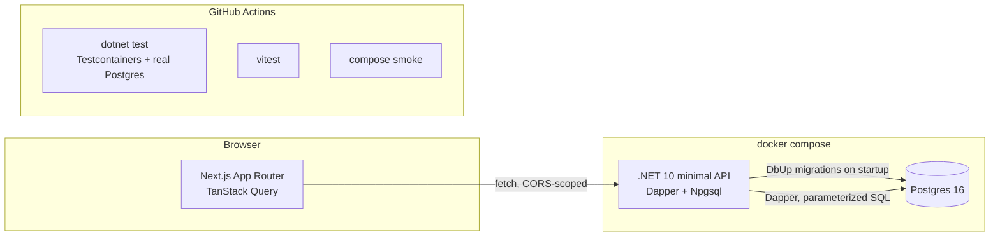

# Taskflow — Task Management System

A small, spec-driven task manager: create tasks, move them through a fixed state
machine, filter/paginate the list, and see a full audit trail of every change. Built
as a demonstration of an **AI-native development process** — the product is
deliberately small; the process is the deliverable. See
[`docs/spec-taskmanager.md`](docs/spec-taskmanager.md) for the contract everything
below was built against.

## Quickstart

```bash
git clone <this-repo>
cd taskflow
docker compose up --build
```

- Web UI: <http://localhost:3000>
- API: <http://localhost:8080/api/v1> (health: `/healthz`, `/readyz`)

From a clean clone this reaches a healthy `db` + `api` + `web` in under two minutes
(`make drill` verifies this in CI).

## Architecture



Backend is vertical-slice minimal APIs (one folder per feature — see
[`.claude/skills/vertical-slice`](.claude/skills/vertical-slice/SKILL.md)), Dapper over
raw parameterized SQL (no EF Core — [ADR-0001](docs/adr/0001-dapper-over-ef-core.md)),
DbUp-versioned migrations run on API startup, and a pure `Domain.StateMachine` as the
single source of truth for legal status transitions
([ADR-0003](docs/adr/0003-state-machine-in-domain-code.md)). Frontend is Next.js App
Router + TypeScript + TanStack Query, talking to the API over CORS-scoped `fetch`.

## API surface

| Method | Path | AC |
|---|---|---|
| `POST` | `/api/v1/tasks` | AC1–AC3 |
| `GET` | `/api/v1/tasks` (filters, pagination) | AC10, AC11 |
| `GET` | `/api/v1/tasks/{id}` | — |
| `PATCH` | `/api/v1/tasks/{id}` | AC9 |
| `POST` | `/api/v1/tasks/{id}/transitions` | AC4–AC7 |
| `GET` | `/api/v1/tasks/{id}/events` | AC7, AC8 |
| `GET` | `/healthz`, `/readyz` | — |

## Test strategy

- **Unit** — pure domain and logic with zero I/O: `Domain.StateMachine` (30
  table-driven cases: every legal pair true, every illegal pair false, terminal states
  empty), `CreateTaskValidator`/`PatchTaskValidator`, `TaskPatchMerger`'s field-merge/diff
  logic, and the frontend's `legalTransitions` mirror (same 30-case table). Any
  time-based rule takes an injected `IClock` — no test can depend on the wall clock.
- **Integration** — one test per acceptance criterion (`AC1`…`AC11`), named
  `AC<N>_...` so the spec-to-test mapping is auditable, run via Testcontainers against
  real Postgres 16 through the actual HTTP pipeline (`WebApplicationFactory`). No
  mocked repository layer anywhere — `scripts/guardrails.sh` flags one mechanically if
  it ever shows up.
- **Frontend** — exactly two Vitest + React Testing Library suites, by design: the
  `legalTransitions` table-driven mirror, and `CreateTaskForm` rendering a mocked 400
  `problem+json` response's field errors inline.

Run everything: `make gate` (guardrails + full .NET pyramid + web lint/test/build).

## Deliberate scope cuts (spec §9)

| Cut | Why |
|---|---|
| AuthN/Z | No multi-user model exists to authenticate against — the assignment evaluates the process, not a product with accounts. |
| Multi-tenancy | Nothing to isolate with a single flat task list; would be a premature abstraction at this size. |
| Projects/boards | Spec models one task list; grouping is a v2 feature with no AC behind it. |
| Comments/attachments | No requirement or AC references them — would add schema and endpoints with zero test coverage driving them. |
| Transactional outbox | No external consumer of task events yet; the audit trail doesn't need at-least-once delivery guarantees. |
| Websockets/live updates | TanStack Query's refetch-on-mutation is enough for a single-user demo; a socket layer has no AC behind it. |
| Rate limiting | No auth means no per-user quota concept, and this isn't internet-facing. |
| Cloud IaC | The assignment names Docker only — `docker compose` is the entire deployment story. |

## How this was built

The evaluated artifact is the process, not just the code. Start here:

- [`CLAUDE.md`](CLAUDE.md) / [`AGENTS.md`](AGENTS.md) — standing instructions every
  agent session ran under (stack, workflow rules, definition of done).
- [`.claude/skills/vertical-slice`](.claude/skills/vertical-slice/SKILL.md) — the
  vertical-slice convention encoded as a skill, not re-explained per session.
- [`.claude/commands`](.claude/commands/) — the workflow verbs
  (`/implement-slice`, `/review-slice`, `/finish-pr`, `/write-adr`).
- [`prompts/`](prompts/) — the exact versioned prompt used to kick off each slice,
  numbered in build order.
- [`docs/AI-DEVELOPMENT.md`](docs/AI-DEVELOPMENT.md) — the session-by-session process
  log: what was asked, what the agent did, every human correction, every AI review
  verdict, elapsed time per slice. This is the real narrative; everything above is the
  scaffolding that produced it.
- [`docs/adr/`](docs/adr/) — the three architecture decisions recorded along the way.

Five feature slices shipped as five squash-merged PRs (bootstrap → create-and-get →
transitions → list-patch → web), each with an independent AI review
(`.github/ai-reviewer-instructions.md`) resolved fix-or-rebut before merge, plus this
packaging pass. See [`CHANGELOG.md`](CHANGELOG.md) for the PR-by-PR history and
[`CONTRIBUTING.md`](CONTRIBUTING.md) for the branch/PR workflow.
